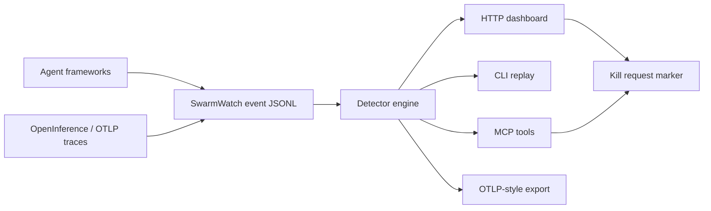

# SwarmWatch

SwarmWatch is a local mission-control screen for multi-agent runs. It has two live mechanisms: **process-live** mode (`swarmwatch run`) launches and supervises an agent command under SwarmWatch, and **stream-live** mode (`swarmwatch attach`) follows a framework or agent event stream that is being written while the run is happening. It renders live topology/cost/alarms and turns the red KILL button into an actual termination request for processes launched through `swarmwatch run`.

SwarmWatch does **not** do injection-live introspection: it does not hook into arbitrary framework internals or observe already-running sessions that SwarmWatch did not launch and that do not emit a followable event stream.

Before: eight background agents, eight terminals, and no idea which one is looping.  
After: launch agents under `npx swarmwatch run ...`, or follow any framework that emits a growing event stream with `npx swarmwatch attach ...`; the local dashboard updates while events arrive and `/api/state` tells you what SwarmWatch has observed and what looks wrong.



## Quickstart

```bash
npx swarmwatch demo      # packaged replay: shows circular delegation + cost alarm

# Stream-live mode: follow a growing event stream emitted by a framework/agent
npx swarmwatch attach --adapter swarmwatch --file live-events.jsonl

# Process-live mode: launch/supervise a process and stream stdout/stderr into the dashboard
npx swarmwatch run --agent worker -- node agent.js

# Manual/event-file mode
npx swarmwatch init
npx swarmwatch ingest --type agent_started --agent planner
npx swarmwatch ingest --type delegation --agent planner --target coder --message "build the API"
npx swarmwatch ingest --type cost --agent coder --cost 1.40 --tokens 50000
npx swarmwatch verify    # validates the event log and reports alarms
npx swarmwatch watch
```

Open the printed `http://127.0.0.1:8787` URL. The dashboard polls the local API while the source is running; no SaaS account and no secrets are required. Mutating HTTP calls require the printed `x-swarmwatch-token`.

Import external traces:

```bash
npx swarmwatch import --adapter langgraph --file langgraph-events.jsonl
npx swarmwatch import --adapter claude-transcript --file claude-session.jsonl  # redacted by default
npx swarmwatch import --adapter claude-flow  # reads .swarm/state.json when present
npx swarmwatch import --adapter openinference --file otel-trace.json
npx swarmwatch export --format otel > swarmwatch-otlp.json
```


## Claude Code plugin install

SwarmWatch can be installed as a Claude Code plugin marketplace:

```text
/plugin marketplace add rudycelekli/swarmwatch
/plugin install swarmwatch
/reload-plugins
/swarmwatch:swarmwatch-init
```

Claude Code namespaces plugin commands, so the installed commands are `/swarmwatch:swarmwatch-init`, `/swarmwatch:swarmwatch-run`, `/swarmwatch:swarmwatch-attach`, and `/swarmwatch:swarmwatch-kill`. The plugin also ships `swarmwatch-alarm`, an ambient structural-alarm skill backed by a quiet monitor. It stays silent unless an active process-live or stream-live session produces a new `runaway_cost`, `circular_delegation`, or `high_fanout` alert. It does not claim injection-live introspection and does not surface replay-mode `stuck_agent` / `dead_agent` alarms.

## Instrument your own agent in 30 seconds

For builders, the fastest path is the tiny SDK reporter. It writes the same JSONL event contract the CLI, dashboard, HTTP API, MCP server, verifier, and OTLP exporter use.

```js
import { createSwarmWatchReporter } from 'swarmwatch';

const swarm = createSwarmWatchReporter({
  agentId: 'planner',
  framework: 'my-agent-runtime'
});

await swarm.started('planning');
await swarm.delegation('coder', 'implement the endpoint');
await swarm.tool('edit_file', { tokens: 1200 });
await swarm.cost(0.03, 2400);
await swarm.done('ready for review');
```

By default this appends to `.swarmwatch/events.jsonl`, so `npx swarmwatch watch` can render it. To emit into a running dashboard instead, pass `url: 'http://127.0.0.1:8787'` and the printed `token`; the reporter posts to `POST /api/events` with `x-swarmwatch-token`. See [docs/INTEGRATIONS.md](docs/INTEGRATIONS.md) and [examples/node-reporter.mjs](examples/node-reporter.mjs).

## Endpoints

### CLI

- `swarmwatch init` — create `.swarmwatch/events.jsonl` and config.
- `swarmwatch watch` / `swarmwatch serve` — local dashboard + API over `.swarmwatch/events.jsonl`.
- `swarmwatch attach` — stream-live follow of a growing `swarmwatch`/JSONL, LangGraph, Claude transcript, or claude-flow source into the dashboard; it tails a file/source and does not introspect arbitrary already-running processes.
- `swarmwatch run` — supervise a command, stream stdout/stderr as live events, and honor kill markers by terminating the child process.
- `swarmwatch ingest` — append one event.
- `swarmwatch import` — convert `swarmwatch`/JSONL, LangGraph events, Claude transcript JSONL, claude-flow state, or OpenInference/OTLP-style traces into SwarmWatch events.
- `swarmwatch export` — print SwarmWatch JSONL or OTLP-style `resourceSpans` for downstream observability tools.
- `swarmwatch demo` — run the packaged deterministic replay from any directory.
- `swarmwatch replay <events.jsonl>` — analyze a captured session.
- `swarmwatch verify` — validate event integrity, print digest, and report alarms.
- `swarmwatch doctor` — check local install/workspace/config health.
- `swarmwatch kill <agentId>` — append a local kill-request event.
- `swarmwatch mcp` — stdio MCP server.

### HTTP

- `GET /api/health`
- `GET /api/state`
- `GET /api/events`
- `GET /api/config`
- `GET /api/verify`
- `POST /api/events` — requires local `x-swarmwatch-token` from server startup/dashboard
- `POST /api/kill/:agentId` — requires local `x-swarmwatch-token` from server startup/dashboard

### MCP tools

- `swarm_state`
- `swarm_ingest`
- `swarm_kill`
- `swarm_verify`

### Library

```js
import { analyzeEvents, startServer, makeEvent, createSwarmWatchReporter, importOtelEvents, exportOtel } from 'swarmwatch';
```

## Open trace bridge

SwarmWatch is built to sit beside standards-based observability stacks rather than lock data inside a local dashboard.

- Import: `--adapter openinference` / `--adapter otel` accepts OTLP-style JSON envelopes (`resourceSpans`) or raw span arrays and maps parent span topology, tool names, cost, tokens, and OpenInference span kinds into SwarmWatch events.
- File-exporter streams: OTLP JSON Lines files are supported; each line may be a full OTLP traces envelope.
- Export: `swarmwatch export --format otel` emits OTLP-style `resourceSpans` with `openinference.span.kind` and `swarmwatch.*` attributes.
- Positioning: use SwarmWatch for local live control and structural swarm safety; forward/export traces to LangSmith, Langfuse, Phoenix, AgentOps, Helicone, Honeycomb, Grafana, or any OTLP pipeline for long-retention analytics.
- Boundary: SwarmWatch is not an OTLP network collector and does not push traces over the network. The bridge covers trace/span topology, OpenInference span kind, tool, cost, token, status, and SwarmWatch evidence fields; model output text requires `--include-text`, and richer vendor-specific span payloads require `--include-raw`.

## Event format

`.swarmwatch/events.jsonl` is newline-delimited JSON. Minimum event:

```json
{"id":"1","ts":"2026-06-13T00:00:00.000Z","type":"agent_started","agentId":"planner"}
```

Useful fields: `parentId`, `targetAgentId`, `framework`, `message`, `tool`, `costUsd`, `tokens`, `status`, `metadata`. Numeric fields must be finite and non-negative; invalid events are rejected before they can corrupt the log.


## Import privacy

Transcript imports are redacted by default. `claude-transcript` and `langgraph` adapters preserve topology/timing and event type, but they do **not** store raw prompt/message payloads unless you explicitly pass `--include-raw` and do **not** store message text unless you pass `--include-text`. OpenInference/OTLP imports preserve trace/span IDs, span names, selected operational attributes, and explicit `swarmwatch.message` attributes by default; generic model output text requires `--include-text`, and the full raw span requires `--include-raw`. Use raw/text flags only for traces you are comfortable keeping in `.swarmwatch/events.jsonl`.

## Alarms

- `runaway_cost` — one agent crosses the configured cost threshold.
- `stuck_agent` — an agent started but has no message/tool activity.
- `dead_agent` — a running agent stopped emitting events.
- `circular_delegation` — delegation graph contains a directed cycle.
- `high_fanout` — one agent fans out beyond the configured child threshold.

Every alert includes evidence fields. The detector engine is deterministic for a fixed event file and config.

## Honest scope

The red KILL button is a **kill-request marker** for imported/external sources. For processes launched through `swarmwatch run`, SwarmWatch also closes the loop and terminates the supervised child when a kill marker for that agent appears. It does not forcibly terminate arbitrary external processes it did not launch.

The live mechanisms are explicit: **process-live** means SwarmWatch launched the command, and **stream-live** means SwarmWatch is following a source that emits events as the run progresses. SwarmWatch is not an injection-live debugger and does not attach to a silent, already-running framework session by magic.

SwarmWatch is not a hosted trace warehouse. It is local live visibility for agent operators who need to see topology and drift while a run is happening.


## Live vs replay semantics

Structural alerts (`runaway_cost`, `circular_delegation`, `high_fanout`) work in both live and replay modes. Clock-relative alerts (`stuck_agent`, `dead_agent`) only run in live mode, because a finished transcript cannot honestly prove that an agent is stuck right now. `demo`, `replay`, `verify`, and `bench` use replay mode and do not emit `stuck_agent`/`dead_agent` from artificial wall-clock age; the dashboard/API served by `watch`, `attach`, and `run` use live mode with a real clock.

## Differentiation

See [docs/DIFFERENTIATION.md](docs/DIFFERENTIATION.md). Short version: SwarmWatch is not trying to be a smaller hosted trace warehouse. It is the local live operator-control layer: launch agents under SwarmWatch, follow frameworks that emit event streams, surface structural graph alarms, expose token-protected local actions, keep replay honest, default imports to privacy, and bridge OpenInference/OTLP from one package.

## Benchmark

`npm run bench -- --check` replays `examples/seed-session.jsonl`, which contains a circular delegation and a cost spike. The benchmark claim is narrow and reproducible: SwarmWatch detects those seeded failures in one local analysis pass. It is a harness benchmark, not a claim about every real agent framework.

```bash
npm run build
npm run bench -- --check
```

## Development

```bash
npm install
npm run build
npm test
npm run test:integration
npm run bench -- --check
npm run smoke:tarball
```

## Prior art & credits

SwarmWatch is inspired by TraceVault-style local traces, mincut-governance-style drift thinking, and ruflo/claude-flow swarm coordination concepts. It is a clean-room implementation by [rudycelekli](https://github.com/rudycelekli).

MIT — see [LICENSE](LICENSE).
