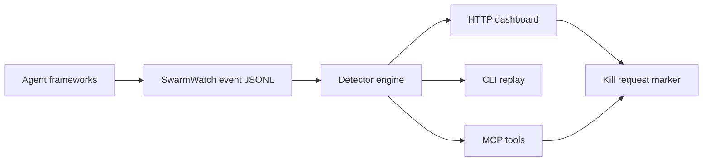

# SwarmWatch

SwarmWatch is a local mission-control screen for multi-agent runs. If you have a planner spawning coders, reviewers, testers, and tool workers, SwarmWatch shows the live topology, per-agent cost, stuck-agent alarms, circular-delegation alarms, and an operator kill-request marker from one local command.

Before: eight background agents, eight terminals, and no idea which one is looping.  
After: `npx swarmwatch` opens a local dashboard and `/api/state` tells you exactly what is running and what looks wrong.



## Quickstart

```bash
npx swarmwatch demo      # packaged replay: shows circular delegation + cost alarm
npx swarmwatch init
npx swarmwatch ingest --type agent_started --agent planner
npx swarmwatch ingest --type delegation --agent planner --target coder --message "build the API"
npx swarmwatch ingest --type cost --agent coder --cost 1.40 --tokens 50000
npx swarmwatch verify    # validates the event log and reports alarms
npx swarmwatch watch
```

Open the printed `http://127.0.0.1:8787` URL. The dashboard polls the local API; no SaaS account and no secrets are required.

Import external traces:

```bash
npx swarmwatch import --adapter langgraph --file langgraph-events.jsonl
npx swarmwatch import --adapter claude-transcript --file claude-session.jsonl
npx swarmwatch import --adapter claude-flow  # reads .swarm/state.json when present
```

## Endpoints

### CLI

- `swarmwatch init` — create `.swarmwatch/events.jsonl` and config.
- `swarmwatch watch` / `swarmwatch serve` — local dashboard + API.
- `swarmwatch ingest` — append one event.
- `swarmwatch import` — convert `swarmwatch`/JSONL, LangGraph events, Claude transcript JSONL, or claude-flow state into SwarmWatch events.
- `swarmwatch demo` — run the packaged deterministic replay from any directory.
- `swarmwatch replay <events.jsonl>` — analyze a captured session.
- `swarmwatch verify` — validate event integrity, print digest, and report alarms.
- `swarmwatch doctor` — check local install/workspace/config health.
- `swarmwatch kill <agentId>` — append a local kill-request event.
- `swarmwatch mcp` — stdio MCP server.

### HTTP

- `GET /api/health`
- `GET /api/state`
- `GET /api/events`
- `GET /api/verify`
- `POST /api/events`
- `POST /api/kill/:agentId`

### MCP tools

- `swarm_state`
- `swarm_ingest`
- `swarm_kill`
- `swarm_verify`

### Library

```js
import { analyzeEvents, startServer, makeEvent } from 'swarmwatch';
```

## Event format

`.swarmwatch/events.jsonl` is newline-delimited JSON. Minimum event:

```json
{"id":"1","ts":"2026-06-13T00:00:00.000Z","type":"agent_started","agentId":"planner"}
```

Useful fields: `parentId`, `targetAgentId`, `framework`, `message`, `tool`, `costUsd`, `tokens`, `status`, `metadata`.

## Alarms

- `runaway_cost` — one agent crosses the configured cost threshold.
- `stuck_agent` — an agent started but has no message/tool activity.
- `dead_agent` — a running agent stopped emitting events.
- `circular_delegation` — delegation graph contains a directed cycle.
- `high_fanout` — one agent fans out beyond the configured child threshold.

Every alert includes evidence fields. The detector engine is deterministic for a fixed event file and config.

## Honest scope

The red KILL button is a **kill-request marker** in v0.1. SwarmWatch records the operator intent through the same event stream; framework adapters can honor it. It does not forcibly terminate arbitrary external processes yet.

SwarmWatch is not a hosted trace warehouse. It is local live visibility for agent operators who need to see topology and drift while a run is happening.

## Benchmark

`npm run bench` replays `examples/seed-session.jsonl`, which contains a circular delegation and a cost spike. The benchmark claim is narrow and reproducible: SwarmWatch detects those seeded failures in one local analysis pass. It is a harness benchmark, not a claim about every real agent framework.

```bash
npm run build
npm run bench
```

## Development

```bash
npm install
npm run build
npm test
npm run test:integration
npm run smoke:tarball
```

## Prior art & credits

SwarmWatch is inspired by TraceVault-style local traces, mincut-governance-style drift thinking, and ruflo/claude-flow swarm coordination concepts. It is a clean-room implementation by [rudycelekli](https://github.com/rudycelekli).

MIT — see [LICENSE](LICENSE).
