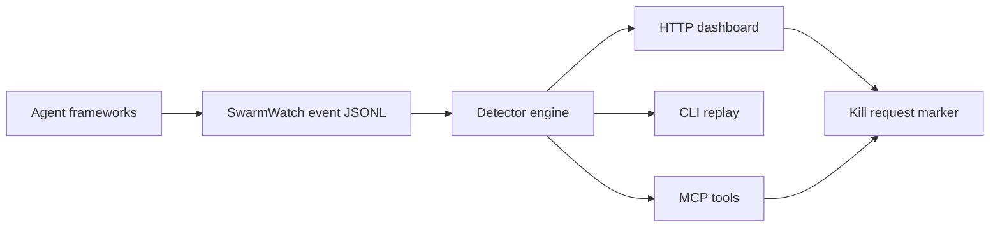

# SwarmWatch

SwarmWatch is a local mission-control screen for multi-agent runs. It can attach to a growing event stream or supervise a running process, render live topology/cost/alarms, and turn the red KILL button into an actual termination request for processes launched through `swarmwatch run`.

Before: eight background agents, eight terminals, and no idea which one is looping.  
After: `npx swarmwatch attach ...` or `npx swarmwatch run ...` opens a local dashboard that updates while events arrive and `/api/state` tells you what SwarmWatch has observed and what looks wrong.



## Quickstart

```bash
npx swarmwatch demo      # packaged replay: shows circular delegation + cost alarm

# Live mode 1: follow a growing event stream
npx swarmwatch attach --adapter swarmwatch --file live-events.jsonl

# Live mode 2: supervise a process and stream stdout/stderr into the dashboard
npx swarmwatch run --agent worker -- node agent.js

# Manual/event-file mode
npx swarmwatch init
npx swarmwatch ingest --type agent_started --agent planner
npx swarmwatch ingest --type delegation --agent planner --target coder --message "build the API"
npx swarmwatch ingest --type cost --agent coder --cost 1.40 --tokens 50000
npx swarmwatch verify    # validates the event log and reports alarms
npx swarmwatch watch
```

Open the printed `http://127.0.0.1:8787` URL. The dashboard polls the local API while the source is running; no SaaS account and no secrets are required. Mutating HTTP calls require the printed `x-swarmwatch-token`.

Import external traces:

```bash
npx swarmwatch import --adapter langgraph --file langgraph-events.jsonl
npx swarmwatch import --adapter claude-transcript --file claude-session.jsonl  # redacted by default
npx swarmwatch import --adapter claude-flow  # reads .swarm/state.json when present
```

## Endpoints

### CLI

- `swarmwatch init` — create `.swarmwatch/events.jsonl` and config.
- `swarmwatch watch` / `swarmwatch serve` — local dashboard + API over `.swarmwatch/events.jsonl`.
- `swarmwatch attach` — live-follow a growing `swarmwatch`/JSONL, LangGraph, Claude transcript, or claude-flow source into the dashboard.
- `swarmwatch run` — supervise a command, stream stdout/stderr as live events, and honor kill markers by terminating the child process.
- `swarmwatch ingest` — append one event.
- `swarmwatch import` — convert `swarmwatch`/JSONL, LangGraph events, Claude transcript JSONL, or claude-flow state into SwarmWatch events.
- `swarmwatch demo` — run the packaged deterministic replay from any directory.
- `swarmwatch replay <events.jsonl>` — analyze a captured session.
- `swarmwatch verify` — validate event integrity, print digest, and report alarms.
- `swarmwatch doctor` — check local install/workspace/config health.
- `swarmwatch kill <agentId>` — append a local kill-request event.
- `swarmwatch mcp` — stdio MCP server.

### HTTP

- `GET /api/health`
- `GET /api/state`
- `GET /api/events`
- `GET /api/config`
- `GET /api/verify`
- `POST /api/events` — requires local `x-swarmwatch-token` from server startup/dashboard
- `POST /api/kill/:agentId` — requires local `x-swarmwatch-token` from server startup/dashboard

### MCP tools

- `swarm_state`
- `swarm_ingest`
- `swarm_kill`
- `swarm_verify`

### Library

```js
import { analyzeEvents, startServer, makeEvent } from 'swarmwatch';
```

## Event format

`.swarmwatch/events.jsonl` is newline-delimited JSON. Minimum event:

```json
{"id":"1","ts":"2026-06-13T00:00:00.000Z","type":"agent_started","agentId":"planner"}
```

Useful fields: `parentId`, `targetAgentId`, `framework`, `message`, `tool`, `costUsd`, `tokens`, `status`, `metadata`. Numeric fields must be finite and non-negative; invalid events are rejected before they can corrupt the log.


## Import privacy

Transcript imports are redacted by default. `claude-transcript` and `langgraph` adapters preserve topology/timing and event type, but they do **not** store raw prompt/message payloads unless you explicitly pass `--include-raw` and do **not** store message text unless you pass `--include-text`. Use those flags only for traces you are comfortable keeping in `.swarmwatch/events.jsonl`.

## Alarms

- `runaway_cost` — one agent crosses the configured cost threshold.
- `stuck_agent` — an agent started but has no message/tool activity.
- `dead_agent` — a running agent stopped emitting events.
- `circular_delegation` — delegation graph contains a directed cycle.
- `high_fanout` — one agent fans out beyond the configured child threshold.

Every alert includes evidence fields. The detector engine is deterministic for a fixed event file and config.

## Honest scope

The red KILL button is a **kill-request marker** for imported/external sources. For processes launched through `swarmwatch run`, SwarmWatch also closes the loop and terminates the supervised child when a kill marker for that agent appears. It does not forcibly terminate arbitrary external processes it did not launch.

SwarmWatch is not a hosted trace warehouse. It is local live visibility for agent operators who need to see topology and drift while a run is happening.


## Live vs replay semantics

Structural alerts (`runaway_cost`, `circular_delegation`, `high_fanout`) work in both live and replay modes. Clock-relative alerts (`stuck_agent`, `dead_agent`) only run in live mode, because a finished transcript cannot honestly prove that an agent is stuck right now. `demo`, `replay`, `verify`, and `bench` use replay mode; the dashboard/API served by `watch`, `attach`, and `run` use live mode.

## Benchmark

`npm run bench -- --check` replays `examples/seed-session.jsonl`, which contains a circular delegation and a cost spike. The benchmark claim is narrow and reproducible: SwarmWatch detects those seeded failures in one local analysis pass. It is a harness benchmark, not a claim about every real agent framework.

```bash
npm run build
npm run bench -- --check
```

## Development

```bash
npm install
npm run build
npm test
npm run test:integration
npm run bench -- --check
npm run smoke:tarball
```

## Prior art & credits

SwarmWatch is inspired by TraceVault-style local traces, mincut-governance-style drift thinking, and ruflo/claude-flow swarm coordination concepts. It is a clean-room implementation by [rudycelekli](https://github.com/rudycelekli).

MIT — see [LICENSE](LICENSE).
